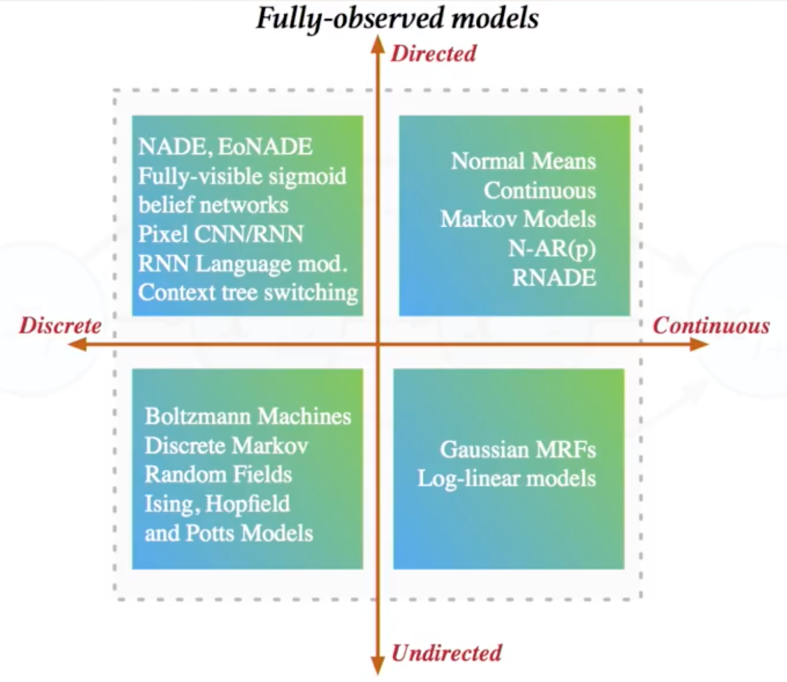
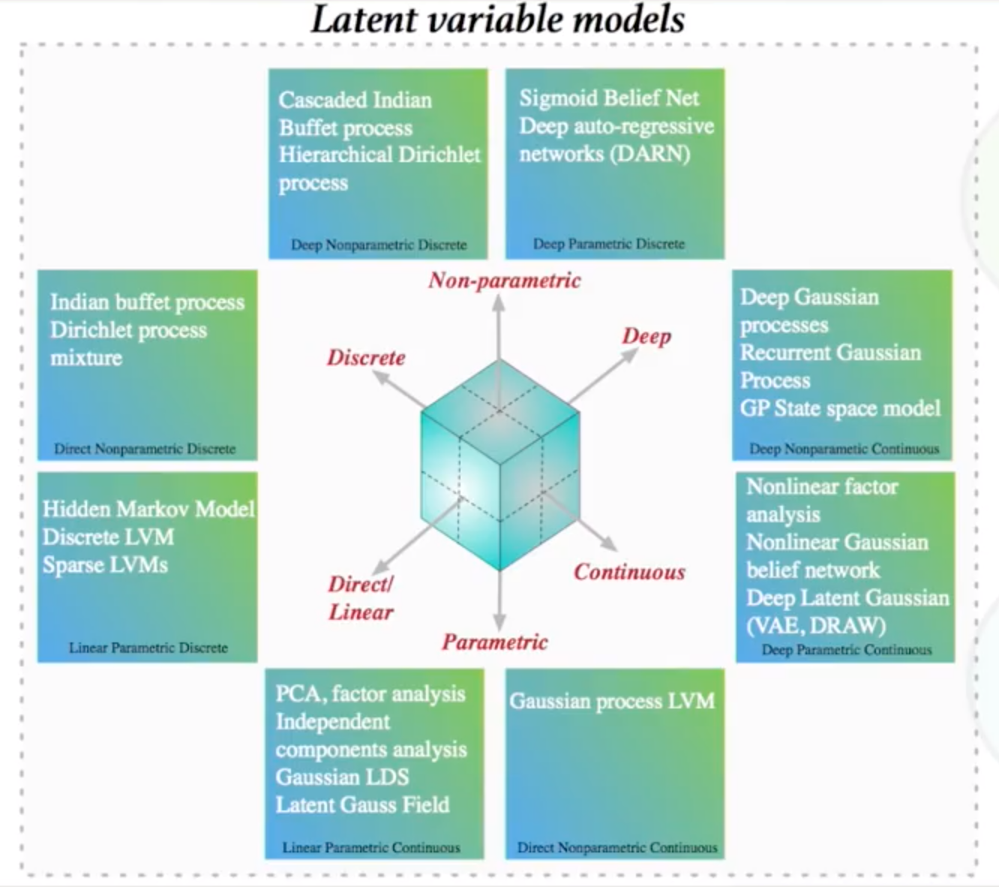
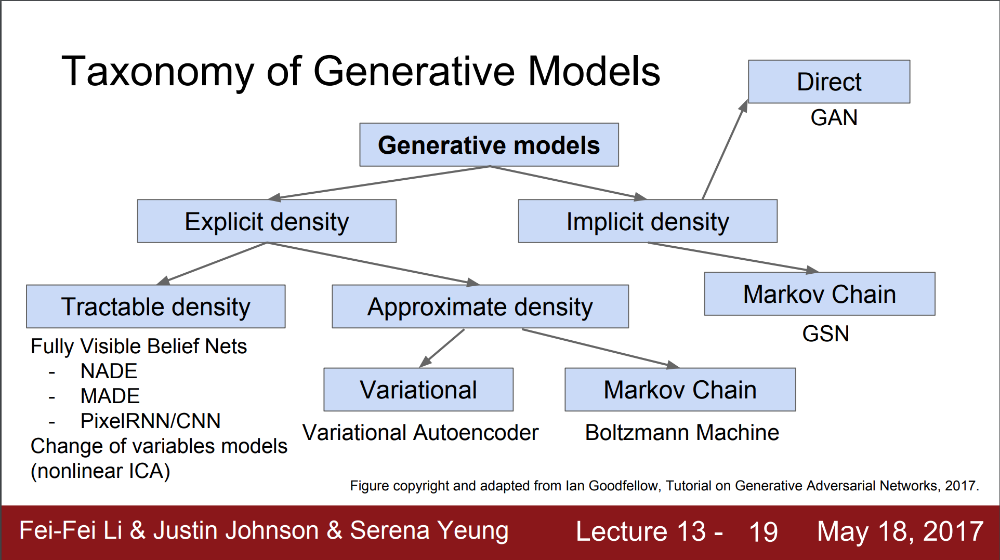

## Deep Generative Models

### What is a Generative Model

When we talk about generative models, we mainly talk about the following 3 types:

1. A model that allows us to learn about a simulator of data. The simulator generates data of desired characteristics - hence generative
2. Models that allow for (conditional) density estimation - learning p(x)
3. Any approach for unsupervised learning of data

The main characterisitcs of generative models are:

* **Probabilistic models** of data that allow uncertainties to be captured and some form of distributions being manipulated
* **Data distribution p(x)** is targeted either directly or indirectly
* **High dimensional outputs** as compared to classifiers. A classifier may have 1-dimensional output for binary classifier, 100-dimensional for ImageNet whereas p(x) of generative models can be entire images or entire sequences or entire speech signals, which will typically be of much higher dimension

> **Note:** This document is meant to be a comprehensive collection of references for deep generative models. We start with a list of references for general ideas and then delve deep into each of the branches.

*References for deep generative models:*

1. [Generative Models-1 - Deep Learning and Reinforcement Learning Summer School, Montreal, 2017, Ian Goodfellow](http://videolectures.net/deeplearning2017_goodfellow_generative_models/)
2. [Generative Models-2 - Deep Learning and Reinforcement Learning Summer School, Montreal, 2017, Aaron Courville](http://videolectures.net/deeplearning2017_courville_generative_models/)
3. [Generative Models-1 - Deep Learning and Reinforcement Learning Summer School, Toronto, 2018, David Kristjanson Duvenaud](http://videolectures.net/DLRLsummerschool2018_duvenaud_generative_models1/)
4. [Generative Models-2 - Deep Learning and Reinforcement Learning Summer School, Toronto, 2018, Phillip Isola](http://videolectures.net/DLRLsummerschool2018_isola_generative_models2/)
5. [Unsupervised Learning and Generative Models - DeepMind course at UCL, 2018, Shakir Mohamed](https://youtu.be/H4VGSYGvJiA)
6. [CS 294-158, Deep Unsupervised Learning, Berkeley, Spring 2019](https://sites.google.com/view/berkeley-cs294-158-sp19/home)

### Types of Generative Models

There can be many ways to classify generative models.

Here's one way of classifying generative models according to [5]:

* **Fully observed models** - model that observes data directly without any new unobserved local variables, e.g. undirected graphical models, auto-regressive models, Boltzmann machines 

* **Latent variable models** - introduce an unobserved random variable for every observed data point to explain hidden causes 

	* **Prescribed models** - Use observer likelihoods (observational data that you have have some form of likelihood function, there is a noise model) and assume observation noise, e.g. directed graphical models with latent variables, where we may say that this model has Gaussian noise and we can use the likelihood function accordingly.
	* **Implicit models** - Likelihood free models. Use the change of variable trick.

Each of the above model types can be visualized based on whether they are directed or undirected and whether they work with discrete or continuous data. Here are the model space visualizations for fully observed and latent variable models:

#### Fully Observed Models

#### Latent Variable Models

	

Here's another way to a general taxonomy of deep generative models based on [1].

* **Explicit Density Models** - Models that define an explicit density function pmodel(x;$\theta$). For these models, maximization of the likelihood is straightforward; we simply plug the model’s definition of the density function into the expression for the likelihood, and follow the gradient uphill. 

Explicit density models can be of the following types:

  * **Tractable Density Models** - Models that define an *explicit density function* that is computationally tractable. There are currently two popular approaches to tractable explicit density models: 

	1. **Fully Visible Belief Networks** - FVBNs are models that use the chain rule of probability to decompose a probability distribution over an n-dimensional vector x into a product of one-dimensional probability distributions:
	  
		  $p_{\text { model }}(\boldsymbol{x})=\prod_{i=1}^{n} p_{\text { model }}\left(x_{i} | x_{1}, \ldots, x_{i-1}\right)$  
	
		Here are some implementations of variants of FVBN:
	  
		* 	[NADE](https://arxiv.org/abs/1605.02226)
		* 	[MADE](https://arxiv.org/abs/1502.03509)
		* 	[PixelRNN](https://arxiv.org/abs/1601.06759) / [PixelCNN](https://arxiv.org/abs/1606.05328)
		* 	[WaveNet](https://arxiv.org/abs/1609.03499)
	
	These are also models with *auto-regressive flows*.
	
	*References for Auto-regressive Flows:*
	
	* [Autoregressive Models in Deep Learning — A Brief Survey](https://eigenfoo.xyz/deep-autoregressive-models/)
	* [Flow-based Deep Generative Models](https://lilianweng.github.io/lil-log/2018/10/13/flow-based-deep-generative-models.html)
	* [Notes on autoregressive models](https://deepgenerativemodels.github.io/notes/autoregressive/)
	* [Autoregressive Autoencoders (MADE)](http://bjlkeng.github.io/posts/autoregressive-autoencoders/)
	* [Deep AutoRegressive Networks](https://arxiv.org/abs/1310.8499)
  
	2. **Nonlinear Independent Components Analysis** - models with explicit density functions is based on defining continuous, nonlinear transformations between two different spaces. For example, if there is a vector of latent variables z and a continuous, differentiable, invertible transformation g such that g(z) yields a sample from the model in x space, then
	
		$p_{x}(\boldsymbol{x})=p_{z}\left(g^{-1}(\boldsymbol{x})\right)\left|\operatorname{det}\left(\frac{\partial g^{-1}(\boldsymbol{x})}{\partial \boldsymbol{x}}\right)\right|$
	
		The density px is tractable if the density pz is tractable and the determinant of the Jacobian of g−1 is tractable. In other words, a simple distribution over z combined with a transformation g that warps space in complicated ways can yield a complicated distribution over x, and if g is carefully designed, the density is tractable too.
		
		Here are some implementations:
		
		* [Real NVP](https://arxiv.org/abs/1605.08803)
		* [NICE](https://arxiv.org/abs/1410.8516)
		* [Glow](https://arxiv.org/abs/1807.03039)
	
	These are also models with *normalizing flows*.
	
	*References for Normalizing Flows:*
	
	* [Flow based deep generative models](https://lilianweng.github.io/lil-log/2018/10/13/flow-based-deep-generative-models.html)
	* [Normalizing Flow Models](https://deepgenerativemodels.github.io/notes/flow/)
	* [Normalizing flows](http://akosiorek.github.io/ml/2018/04/03/norm_flows.html)
	* [Normalizing flows Tutorial: Part 1 - Distributions and Determinants](https://blog.evjang.com/2018/01/nf1.html)
	* [Normalizing flows Tutorial: Part 2 - Modern Normalizing Flows](https://blog.evjang.com/2018/01/nf2.html)
	* [Good explanation and derivation of change of variables of a probability density function](https://stats.stackexchange.com/questions/239588/derivation-of-change-of-variables-of-a-probability-density-function)
	* [Variational inference with normalizing flows](https://arxiv.org/abs/1505.05770)
	* [What are Normalizing Flows - a short tutorial](https://youtu.be/i7LjDvsLWCg)
	* [Normalizing Flows for Probabilistic Modeling and Inference](https://arxiv.org/abs/1912.02762)

	* **Approximate Density Models** - Models that provide an explicit density function but use one that is intractable, requiring the use of approximations to maximize the likelihood. These fall roughly into two categories: those using deterministic approximations, which almost always means variational methods, and those using stochastic approximations, meaning Markov chain Monte Carlo methods.

		1. **Variational Approximation** - Variational methods define a lower bound
		
			$\mathcal{L}(\boldsymbol{x} ; \boldsymbol{\theta}) \leq \log p_{\operatorname{model}}(\boldsymbol{x} ; \boldsymbol{\theta})$.
			
			A learning algorithm that maximizes L is guaranteed to obtain at least as high a value of the log-likelihood as it does of L. For many families of models, it is possible to define an L that is computationally tractable even when the log-likelihood is not.
			
			Implementation:
			
			* 	Variational Autoencoder ([VAE](https://arxiv.org/abs/1312.6114))
		
			A detailed reference list for VAEs can be found [here](https://github.com/debasishg/ml-readings/blob/master/vae.md).
		
		2. **Markov Chain Approximations** - Models that make use of some form of stochastic approximation, at the very least in the form of using a small number of randomly selected training examples to form a minibatch used to minimize the expected loss.
		
			Implementation:
			
			* Boltzmann Machines
			
			*References:*
			
			* [G. E., Osindero, S., and Teh, Y. (2006). A fast learning algorithm for deep belief nets. Neural Computation, 18, 1527–1554](https://dl.acm.org/citation.cfm?id=1161605)
			* [Hinton, G. E. (2007). Learning multiple layers of representation. Trends in cognitive sciences, 11(10), 428–434](https://www.cs.toronto.edu/~hinton/absps/tics.pdf)
	
	Some models use both variational and Markov chain approximations. For example, deep Boltzmann machines make use of both types of approximation.

* **Implicit Density Models** - Some models can be trained without even needing to explicitly define a density functions. These models instead offer a way to train the model while interacting only indirectly with pmodel, usually by sampling from it. These constitute the implicit density models.

	* **Markov Chain based Models** - Some of these implicit models based on drawing samples from pmodel define a Markov chain transition operator that must be run several times to obtain a sample from the model. From this family, the primary example is the Generative Stochastic Network.
		
		*References:*
		
		* [Bengio, Y., Thibodeau-Laufer, E., Alain, G., and Yosinski, J. (2014). Deep generative stochastic networks trainable by backprop. In ICML’2014](https://arxiv.org/abs/1306.1091)
	
	* **Direct Models** - Family of implicit models that can generate a sample in a single step. At the time of their introduction, GANs were the only notable member of this family, but since then they have been joined by additional models based on kernelized moment matching.

		*References:*
		
		* [Ian J. Goodfellow, Jean Pouget-Abadie, Mehdi Mirza, Bing Xu, David Warde-Farley, Sherjil Ozair, Aaron Courville, Yoshua Bengio. (2014). Generative Adversarial Networks](https://arxiv.org/abs/1406.2661)